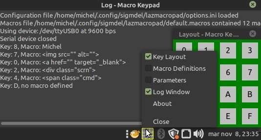

# *lazmacropad* - a Macro Keypad
**Version 0.7.2**

A rudimentary macro keypad based on the Arduino Nano and a simple Free Pascal/Lazarus program that pastes macros into the currently focused desktop application.

Currently the macro keypad program has been tested and found to run on Linux Mint 20.1 Mate, Mint 21 Mate and Windows 10 although there are some limitations as described below. 




As of version 0.6.0, *lazmacropad* is a tray application. This required a major reorganization of the source code. The three different tabs of the original program, [version 0.3.0](releases/tag/v0.3.4), where moved to windows that can be displayed independently as illustrated in the screenshot shown above.

**Table of Content**
<!-- TOC -->

- [1. Hardware](#1-hardware)
- [2. Theory of Operation](#2-theory-of-operation)
- [3. Source Code and Prerequisites](#3-source-code-and-prerequisites)
  - [3.1. Linux Requirements](#31-linux-requirements)
    - [3.1.1. `Xtst` Library](#311-xtst-library)
    - [3.1.2. `xKeyInput.pas` Bug Fix](#312-xkeyinputpas-bug-fix)
    - [3.1.3. Compiler Versions and Linux Widgetsets](#313-compiler-versions-and-linux-widgetsets)
  - [3.2. Windows Requirements](#32-windows-requirements)
- [4. Macros](#4-macros)
- [5. Ctrl+V vs Shift+Insert](#5-ctrlv-vs-shiftinsert)
- [6. Accommodating Different Keypads](#6-accommodating-different-keypads)
- [7. Acknowledgment](#7-acknowledgment)
- [8. Licence](#8-licence)

<!-- /TOC -->
## 1. Hardware

Only three items are needed to implement a basic macro keypad:

  1. A switch matrix. The program assumes that the key pad is composed of 16 switches arranged in a 4 x 4 matrix.

  2. An Arduino Nano R3. This is an older, smaller, Arduino board based on the ATmega328P microcontroller. It has a Mini-B USB socket, but some clones come with a Micro or Type-C USB connector.

  3. An appropriate USB cable to connect the Nano to a desktop or portable computer.

Basically, any development board with 8 digital I/O pins and a serial port could be used, but the Nano and the readily available 4x4 tactile push button matrix shown below are very easily connected to each other.


Note that the Nano is upside down (microcontroller is on the hidden side of the board) so that the USB cable will go off to the right. The Nano could be connected facing in the other direction by flipping it right side up if it is more convenient to orient the cable towards the left. The character transmitted over the serial port as of each key is pressed and the mapping of the Nano I/O pins should be modified in the Arduino sketch running on the Nano. 

## 2. Theory of Operation

```
4 rows x 4 columns key pad
+-------------- +                   +------+                +----------------------------------------+
| o   o   o   o |                   | Nano |                |  Desktop                               |
| o   o   o   o | <---------------> |  v3  |                |                                        |
| o   o   o   o |     eight I/O     |      | <-- serial --> | <---> Lazarus service --> Application  | 
| o   o   o   o | <---------------> |      |                |                                        |
+-------------- +                   +------+                +----------------------------------------+
```               

The Nano continuously scans the key pad. When it detects that a key has been pressed, it sends a corresponding single letter string or *message* (i.e. '0', '1' or 'f') to the desktop or portable over the serial (USB) connection. 

The Lazarus/Free Pascal program translates macro key *messages* from the Nano into strings or macros that are sent to whichever application is active on the desktop. Each macro is copied to the system clipboard and then a Ctrl+V or Shift+Insert key combination is injected into the keyboard event queue of the active application to paste the content of the clipboard.

The program also allows for editing, saving and loading macro definitions to suit any number of applications on the desktop.

There is a [post about this project](https://sigmdel.ca/michel/program/fpl/macrokeypad/basic_macrokeypad_fr.html) which contains a rudimentary *user manual*. It is an incomplete draft curently available in French only.

## 3. Source Code and Prerequisites

[nanoMacroPad.ino](nanoMacroPad/nanoMacroPad.ino) contains the Arduino sketch that runs on the Nano. It requires the [Keypad library](https://playground.arduino.cc/Code/Keypad/) ([GitHub repository](https://github.com/Chris--A/Keypad)) by Mark Stanley and Alexander Brevig. It can be installed with the Arduino IDE library manager.

The source code of the *lazmacropad* object pascal program is in the root directory of the repository. The [images](images/) directory contains the two images shown on this page. Neither of these are required to compile the program. 

The [`MouseAndKeyInput`](https://wiki.lazarus.freepascal.org/MouseAndKeyInput) unit is used to generate the desired paste keyboard shortcut. The unit is found in the `lazmouseandkeyinput.lpk` non-visual package. That package is in the `$(LAZARUS)/components/mouseandkeyinput` directory. Load the package file into the Lazarus IDE and compile it. Add `lazmouseandkeyinput` to the `Required Packages` in the `Project Inspector` window (which is opened from the `Project` menu in the IDE).

### 3.1. Linux Requirements

#### 3.1.1. `Xtst` Library

The `Xtst` library is required by the `lazmouseandkeyinput.lpk` package. In recent versions of Debian, the package containing this library is called `libxtst6` and it is probably included in most Debian-based desktop distributions. This is the case for Linux Mint 20.1 Mate and Mint 21 Mate. Should the library be missing, it can be installed in the usual fashion.

```bash
$ apt install libxtst6
```

Although the library was installed in Mint 20.1, it could not be found because of a missing symbolic link to `libXtst.so`. 

```bash
$ locate libXtst
/usr/lib/x86_64-linux-gnu/libXtst.so.6
/usr/lib/x86_64-linux-gnu/libXtst.so.6.1.10
```

In that case, add the symbolic link and update the library database.

```bash
$ cd /usr/lib/x86_64-linux-gnu
$ sudo ln -s libXtst.so.6.1.0 libXtst.so
$ sudo updatedb
```

The directory in which are stored system libaries are stored is not necessary called `/usr/lib/x85_64-linux-gnu` so adust the above in accordance with the output obtained from the `locate` command.

It appears some have been installing the development package `libxtst-dev` in a bid to add the missing symbolic link, but there is no need for that. 


#### 3.1.2. `xKeyInput.pas` Bug Fix

Chances are the program will work, except in some *older* distributions. An unending sequence of key-down events can be generated by the injected paste key combination. Those virtual key down events will continue until a key on the physical keyboard is pressed. As it happens, Mint 20.1 released in January 2021 (an LTS version valid until 2025) and Mint 21 only recently release are among those *older* distributions. The solution to that problem is to change the type of the `is_press` argument in the `XTestFakeKeyEvent` function to `Boolean32` instead of `Boolean`. The function is in the file `$(lazarus)/components/mouseandkeyinput/xkeyinput.pas`. The problem and solution were provided by bytesbites in an August 16, 2016 [forum post](https://forum.lazarus.freepascal.org/index.php/topic,33719.msg218852.html#msg218852). See issues [27819](https://gitlab.com/freepascal.org/lazarus/lazarus/-/issues/27819) and [39964](https://gitlab.com/freepascal.org/lazarus/lazarus/-/issues/39964) in the Lazarus Gitlab repository.


#### 3.1.3. Compiler Versions and Linux Widgetsets

The program was developed in Linux Mint 20.1 Mate using Lazarus 2.3.0 (rev main-2_3-1602-gdb285860e3) FPC 3.3.1 x86_64-linux-gtk2. The resulting binary runs without limitations in Linux Mint 20.1 and Mint 21.

The source code was also compiled in Mint 21 using a slightly more recent, trunk version, of the compiler: Lazarus 2.3.0 (rev main-2_3-2735-g4628b33d4a) FPC 3.3.1 x86_64-linux-qt5. Note that the Qt5 widgetset was used instead of the "default" GTK2 widgetset. This required installing `libqt5pas1_2.10xxxx` and `libqt5pas-dev_2.10xxxx` libraries by David Bannon (Davo aka dbannon on the Lazarus forum) from his [Github repository](https://github.com/davidbannon/libqt5pas) instead of the `libqt5pas` and `libqt5pas-dev` from the Debian repository. The program compiled for that widgetset does work when using Ctrl+V as the paste shortcut, but pasting macros with the Shift+Insert shortcut fails. Consequently, until a solution is found, a Qt5 version of the program will not be released.

### 3.2. Windows Requirements

The source was compiled and tested with two versions of Lazarus in Windows 10:

- stable: Lazarus 2.2.4 (rev lazarus_2_2_4) FPC 3.2.2 i386-win32-win32/win64
- trunk: Lazarus 2.3.0 (rev main-2_3-2734-g2f18817fd8) FPC 3.3.1 i386-win32-win32/win64

There are cosmetic problems with the macro definition screen with the binary generated with the stable version of the compiler. The maximum column width of the first column is not respected. While there is a work around, it is not included in the source code because that bug has been removed in the trunk version of the compiler. Because it is a bit more difficult to install the trunk version of the compiler, Windows binaries compiled with the trunk version of the compiler are supplied in the [0.6.0 release](https://github.com/sigmdel/lazmacropad/releases/tag/v0.6.0). Binaries for the latest release are upcoming.

Note: The Windows version of the `Serial` unit does have a serial connection status variable. Consequently, there will be a log message about a lost connection when running in Windows. Furthermore, selection of the clipboard paste command used internally by the program is ignored in the Windows version. 

## 4. Macros

Macros are just (UTF8) strings, but 3 escape sequences are defined:

  -  '\n' will be converted to #13 (RETURN)
  -  '\t' will be converted to #9  (TAB)
  -  '\\\\' will be converted to '\\' 

Appending a \n sequence to a macro to be used in the terminal will mean that it will be executed as soon as the corresponding key is pressed. This could be used to start a program. Be careful, some programs such as the Arduino IDE can grab the serial port and, as a result, *lazmacropad* freezes.

## 5. Ctrl+V vs Shift+Insert

The GNOME terminal emulator and its forks such as the MATE terminal do not support the Ctrl+C and Ctrl+V key combinations, which makes sense since Ctrl+C is used to cancel a running program. On the other hand, it is possible to paste the primary selection in the terminal with Shift+Insert. Consequently, when the Shift+Insert combination is chosen to paste a macro, *lazmacropad* copies the macro into the primary selection in addition to copying it into the clipboard. It is therefore possible to insert macros when typing in the terminal. This is pretty much the behavior of Geany apps, VSCodium (and probably VS Code), GNote, LibreOffice Writer and the Lazarus IDE editor, which synchronize the two mechanisms by pasting selected text with Ctrl+V or Shift+Insert.

If a macro ends with the sequence '\n' and the Shift+Insert combination is used for the paste operation then it will be executed as a command if inserted at a terminal prompt. A program could be launched or a script could be executed by pressing a single key. Care must be taken when running programs, as some, such as the Arduino IDE, may seize the serial port and as a result *lazmacropad* freezes.

There is no primary selection in Windows but Shift+Insert does work just as Ctrl+V when used from the physical keyboard. So far, injecting Shift+Insert in Windows has not worked. Consequently *lazmacropad* uses Ctrl+V no matter what keyboard shortcut is specified when it is running in Windows.

## 6. Accommodating Different Keypads

With version 0.7.2, *lazmacropad* can handle keypads with up to 36 keys. The number of rows and columns must be specified in the configuration file. Open the log and parameters windows. Make sure that the `Log Level` is set to `Information` or `Debug` and then click on the `Save Configuration` button. The full path of the configuration file, `options.ini`, will be displayed in the log. Close *lazmacropad*, the edit the `[keypad]` section of the configuration file, specifying the number of columns and rows in the key matrix.

```ini
[keypad]
cols=3
rows=5
```

When *lazmacropad* is restarted, it will display the correct number of macros and the keymap will be adjusted to reflect the keypad matrix size. 

**While it might not be immediately obvious, it will be necessary to upload the modified version 0.7.2 Arduino sketch running to the microprocessor unless the keypad contains 10 or less keys.** 

## 7. Acknowledgment

There is no shortage of information on all sorts of more or less sophisticated macro key pads. The Brian Lough video, [The Simplest DIY Macro Keypad with Arduino](https://www.youtube.com/watch?v=ORujXGDqG_I&ab_channel=BrianLough) and corresponding [GitHub repository, arduino-switcheroonie,](https://github.com/witnessmenow/arduino-switcheroonie) stands out for its simplicity, but that project is based on an Arduino Pro Micro. The Cristian Bastidas (crixodia) [arduino-nano-macro-keypad](https://github.com/crixodia/arduino-nano-macro-keypad) GitHub repository showed how to achieve something very similar  with a Nano and a Python script on the desktop. This later project is clearly the model for *lazmacropad*.

## 8. Licence

Copyright 2022, Michel Deslierres, no rights reserved.

In those jurisdictions where releasing a work into the public domain may be a problem, the **BSD Zero Clause Licence** ([SPDX](https://spdx.dev/): [0BSD](https://spdx.org/licenses/0BSD.html)) applies.
