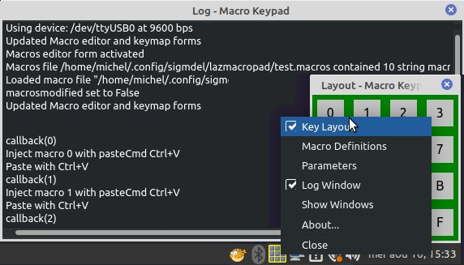

# *lazmacropad* - a Macro Keypad

**Current Source Version: 0.9.0** (August 18, 2023)


**Current Release Version: 0.8.6** (November 20, 2022)

A simple macro keypad build around an AVR microcontroller and written in Free Pascal / Lazarus. Its distinguishing feature is that it is keymap agnostic because it uses the operating system clipboard to paste strings into the currently running application. Nevertheless, macros can be injected as keystrokes if desired.


**Table of Content**
<!-- TOC -->

- [1. Description](#1-description)
- [2. Status](#2-status)
  - [2.1. The 0.3.4 Release](#21-the-034-release)
  - [2.2. The 0.8.6 Release](#22-the-086-release)
  - [2.3. The 0.8.9 Source Code](#23-the-089-source-code)
- [3. Hardware](#3-hardware)
- [4. Source Code and Prerequisites](#4-source-code-and-prerequisites)
  - [4.1. Linux Requirements](#41-linux-requirements)
    - [4.1.1. `Xtst` Library](#411-xtst-library)
    - [4.1.2. `xKeyInput.pas` Bug Fix](#412-xkeyinputpas-bug-fix)
    - [4.1.3. Serial USB Device Problem in Mint 21 and Ubuntu 22.04](#413-serial-usb-device-problem-in-mint-21-and-ubuntu-2204)
    - [4.1.4. Compiler Versions and Linux Widgetsets](#414-compiler-versions-and-linux-widgetsets)
  - [4.2. Windows Requirements](#42-windows-requirements)
- [5. Macros](#5-macros)
- [6. Clipboards and Paste Commands](#6-clipboards-and-paste-commands)
- [7. Accommodating Different Keypads](#7-accommodating-different-keypads)
- [8. Documentation](#8-documentation)
- [9. Acknowledgment](#9-acknowledgment)
- [10. Licence](#10-licence)

<!-- /TOC -->

## 1. Description 

This project describes a simple macro keypad serially connected to a computer. The keypad is continuously scanned by a microcontroller (an Arduino Nano) which transmits a single letter string or *message* ('0', '1', ...) when a key on the pad is pressed. These *messages* are translated into *macros* by Lazarus/Free Pascal program running in the background. When the macro is a string it is copied to the system clipboard and then an emulated key combination (Ctrl+V, Shift+Insert, or a user-defined custom key combination) is injected into the keyboard event queue of the active application to paste the content of the clipboard. Starting with version 0.8.0 it is possible to bypass the clipboard altogether and to inject a macro consisting of an array of keyboard events.

The Lazarus program also allows for editing, saving and loading macro definitions to suit any number of applications on the desktop.

## 2. Status

### 2.1. The 0.3.4 Release

[Version 0.3.4](releases/tag/v0.3.4) was the last release where *lazmacropad* ran as a normal program. As of version 0.6.0, *lazmacropad* is a tray application. 

### 2.2. The 0.8.6 Release

The 0.8.6 [release](releases/tag/v0.8.6) of *lazmacropad* was built in Linux Mint 20.1 MATE using the GTK2 widget set. The program has also been compiled in Windows 10 (64 bits) and it seems to work in that environment although there are some limitations as described below. 

The release contains binaries for those that want to test without compiling the program. However the Linux binary will not function unless the Xtst library is installed ([instructions below](#411-xtst-library)). There is no need to even build the macro keypad to test the software in Linux. Clicking on a key in the green layout window shown below simulates pressing on the corresponding key on a physical macro keypad. There's also experimental handling of trailing new line characters discussed further down.



### 2.3. The 0.9.0 Source Code

Version 0.9.0, currently only available as source code, is being tested in Linux Mint 21.2 MATE using the Qt5 widget set. Tests have yet to be done in Windows. The significant changes with the 0.8.6 version are

  - some [code simplifications](https://github.com/sigmdel/lazmacropad/commit/9b92465359ca4fd64766c152c662aad5251ee0d1) to query if modified macros should be saved when closing the app
  - a [fix](https://github.com/sigmdel/lazmacropad/commit/7f25647c559735cd8b38d333059180b85a1d2e33) for a bug that made it difficult to pick `Ctrl-V` as the paste command in the macro definitions window.
  - [better form properties](https://github.com/sigmdel/lazmacropad/commit/fc07c4ef73034f56ea44a0b33db9fdc4d56c7b83) to improve the auto column widths in the macros definition form
  - [refactored](https://github.com/sigmdel/lazmacropad/commit/6feefdb28a8d5e1d2f17ff2a9a59e57478230854) handling of paste commands
  - a [fix](https://github.com/sigmdel/lazmacropad/commit/8db42fafb89b3744ba6d6233cd1ff7bc39e17145) for a bad bug that caused loss of kbdmacros when inserting, deleting or moving macros in the macro definitions window
  - [addition](https://github.com/sigmdel/lazmacropad/commit/eb6105e60e0896c848d929c4620c4818d3dd3519) of a serial connection alive message. The microcontroller firmware **must be updated** to version 2.

## 3. Hardware

Only three items are needed to build a basic macro keypad:

  1. An Arduino Nano R3. This is an older, smaller, Arduino board based on the ATmega328P microcontroller. It has a Mini-B USB socket, but some clones come with a Micro or Type-C USB connector.

  2. A switch matrix. The program assumes that the key pad is composed of 16 switches arranged in a 4 x 4 matrix. The Arduino sketch on the Nano and *lazmacropad* can handle keypads with up to 36 keys (and more with changes to the code). Of course, a 36 key array requires a minimum of 12 I/O pins. Not all microcontrollers have so many I/O pins, but the Nano does have 18 digital I/O pins plus the Rx and Tx pins for the serial connection.

  3. An appropriate USB cable to connect the Nano to a desktop or portable computer.

The Nano and the readily available 4x4 tactile push button matrix shown below are very easily connected to each other.


Note that the Nano is upside down (microcontroller is on the hidden side of the board) so that the USB cable will go off to the right. The Nano could be connected facing in the other direction by flipping it right side up if it is more convenient to orient the cable towards the left. The character transmitted over the serial port as each key is pressed and the mapping of the Nano I/O pins in the Arduino sketch should be modified according to the number rows and columns of keys on the keypad and its desired orientation. 

## 4. Source Code and Prerequisites

[nanoMacroPad.ino](nanoMacroPad/nanoMacroPad.ino) contains the Arduino sketch that runs on the Nano. It requires the [Keypad library](https://playground.arduino.cc/Code/Keypad/) ([GitHub repository](https://github.com/Chris--A/Keypad)) by Mark Stanley and Alexander Brevig. It can be installed with the Arduino IDE library manager. A `platformio.ini` configuration file which takes care of this dependancy in PlatformIO is now included.

**The microcontroller firmware must be updated to version 2 which is supplied with version 0.9.0 of *lazmicropad***. 

The source code of the *lazmacropad* object pascal program is in the root directory of the repository. The [images](images/) directory contains the three images shown on this page. None are required to compile the program. 

The [`MouseAndKeyInput`](https://wiki.lazarus.freepascal.org/MouseAndKeyInput) unit is used to inject key press and release events into the operating system keyboard driver. The unit is found in the `lazmouseandkeyinput.lpk` non-visual package. That package is in the `$(LAZARUS)/components/mouseandkeyinput` directory. Load the package file into the Lazarus IDE and compile it. Add `lazmouseandkeyinput` to the `Required Packages` in the `Project Inspector` window (which is opened from the `Project` menu in the IDE).

### 4.1. Linux Requirements

#### 4.1.1. `Xtst` Library

The `Xtst` library is required by the `lazmouseandkeyinput.lpk` package. In recent versions of Debian, the package containing this library is called `libxtst6` and it is probably included in most Debian-based desktop distributions. This is the case for Linux Mint 20.1 Mate and Mint 21 Mate. If the library is missing, it can be installed in the usual fashion.

```bash
$ apt install libxtst6
```

Although the library was installed in Mint 20.1, it could not be found because of a missing symbolic link to `libXtst.so`. 

```bash
$ locate libXtst
/usr/lib/x86_64-linux-gnu/libXtst.so.6
/usr/lib/x86_64-linux-gnu/libXtst.so.6.1.10
```

In that case, add the symbolic link and update the library database.

```bash
$ cd /usr/lib/x86_64-linux-gnu
$ sudo ln -s libXtst.so.6.1.0 libXtst.so
$ sudo updatedb
```

The directory in which are stored system libraries are stored is not necessarily called `/usr/lib/x85_64-linux-gnu` so adust the above in accordance with the output obtained from the `locate` command.

It appears some have been installing the development package `libxtst-dev` in a bid to add the missing symbolic link, but there is no need for that. 


#### 4.1.2. `xKeyInput.pas` Bug Fix

Chances are the program will work, except in some *older* distributions. An unending sequence of key-down events can be generated by the injected paste key combination. Those virtual key down events will continue until a key on the physical keyboard is pressed. As it happens, Mint 20.1 released in January 2021 (an LTS version valid until 2025) and Mint 21 only recently release are among those *older* distributions. The solution to that problem is to change the type of the `is_press` argument in the `XTestFakeKeyEvent` function to `Boolean32` instead of `Boolean`. The function is in the file `$(lazarus)/components/mouseandkeyinput/xkeyinput.pas`. The problem and solution were provided by bytesbites in an August 16, 2016 [forum post](https://forum.lazarus.freepascal.org/index.php/topic,33719.msg218852.html#msg218852). The issue [27819](https://gitlab.com/freepascal.org/lazarus/lazarus/-/issues/27819) was raised 8 years ago and more recently [39964](https://gitlab.com/freepascal.org/lazarus/lazarus/-/issues/39964) in the Lazarus Gitlab repository. Many still come across this [problem](https://forum.lazarus.freepascal.org/index.php/topic,62065.0.html).

#### 4.1.3. Serial USB Device Problem in Mint 21 and Ubuntu 22.04

The serial device, usually `/dev/ttyUSB0` on my systems, would not be created on connection of the Nano to the desktop in Mint 21 and Ubuntu 22.04. That was unusual because the USB device was found.

```bash
michel@hp:~$ lsusb
...
Bus 003 Device 006: ID 1a86:7523 QinHeng Electronics HL-340 USB-Serial adapter
... 
```

That means that the Arduino IDE could not be used to flash the sketch on the Nano nor could a flashed macro keypad work with those systems. The following log entry provided a hint as to the cause of the problem.
  
```
usbfs: interface 0 claimed by ch34x while 'brltty' sets config #1 #18 
```

A quick search yielded a couple of **StackExchange** queries ([Unable to use [...] on USB-serial converter chip](https://unix.stackexchange.com/questions/670636/unable-to-use-usb-dongle-based-on-usb-serial-converter-chip) and [On Linux Min21, unable to access tools/port...)](https://arduino.stackexchange.com/questions/90954/on-linux-min21-unable-to-access-tools-port-grayed-out) and a blog post ([Solved: brltty – USB COM Port Gets Immediately Disconnected](https://lynxbee.com/solved-brltty-usb-com-port-gets-immediately-disconnected/#.Y20o5ZCZNhE)). It seems that the screen reader [BRLTTY](https://brltty.app/) is now enabled by default and it takes over the serial port which I assume would be connected to a Braille display.

There are two ways to "resolve" the situation: disable the service as explained in the first two references or remove the `brltty` package altogether with the usual `apt remove brltty` command as explained in the last reference. Unfortunately, this is not a working solution for those that need the screen reader.  

#### 4.1.4. Compiler Versions and Linux Widgetsets

Up to version 0.8.6, the program was developed in Linux Mint 20.1 Mate using Lazarus 2.3.0 / FPC 3.3.1 / x86_64-linux-gtk2. The resulting GTK2 binary runs without limitations in Linux Mint 20.1 and Mint 21. The [2022-11-26 Linux binary](https://github.com/sigmdel/lazmacropad/releases/tag/v0.8.6) was compiled with revision main-2_3-2933-g3bdcb55eb2. The no longer available 2022-11-21 Linux binary compiled with revision main-2_3-2897-gecf49109b1 introduced a bug. The problem, which would manifest itself when closing *lazmacropad* if changes had been made to the macro file, had not existed in binaries compiled with previous revisions of Lazarus.

~~The source code was also compiled in Mint 21 using the QT5 widget set instead of the "default" GTK2 widget set. This required installing `libqt5pas1_2.10xxxx` and `libqt5pas-dev_2.10xxxx` libraries by David Bannon (Davo aka dbannon on the Lazarus forum) from his [Github repository](https://github.com/davidbannon/libqt5pas) instead of the `libqt5pas` and `libqt5pas-dev` from the Debian repository. The program compiled for that widget set does work when using Ctrl+V as the paste shortcut, but pasting macros with the Shift+Insert shortcut fails. Consequently, until a solution is found, a Qt5 version of the program will not be released.~~

Version 0.8.9 has been compiled in Linux Mint 21.2 with Lazarus 2.2.7 (rev lazarus_2_2_6-1-gada7a90f86) FPC 3.2.3 x86_64-linux-qt5. There was no obvious problem using the default Pascal bindings for the QT5 widget set found in the Ubuntu repository (libqt5pas1: 2.6+2.0.8+dfsg-2 and libqt5pas-dev: 2.6+2.0.8+dfsg-2).

### 4.2. Windows Requirements

The 0.8.6 source was compiled and tested with two versions of Lazarus in Windows 10:

- stable: Lazarus 2.2.4 (rev lazarus_2_2_4) FPC 3.2.2 i386-win32-win32/win64
- trunk: Lazarus 2.3.0 (rev main-2_3-2734-g2f18817fd8) FPC 3.3.1 i386-win32-win32/win64

It is recommended to use the trunk version because cosmetic problems were encountered with the stable version in the macro definition window. **Update**: this was probably the author's error and the same problem was encountered in the 0.8.9 Qt5 version. The [true solution](commit/fc07c4ef73034f56ea44a0b33db9fdc4d56c7b83) was to properly define the column `SizePriority` property (). 

Notes: 
- The Windows version of the `Serial` unit does not have a serial connection status variable. Consequently, log messages warning of a lost connection will not appear when running in Windows.
- No tests for the Linux bug described in the previous section have been done.

## 5. Macros

There are two types of macros:

  - Strings that are copied to the clipboard and, from there, pasted into an application with a user selectable keyboard paste command.
  - Arrays of keyboard events directly injected into the operating system keyboard handler.


Macros 3 and 4, in the macro definition window shown above, both inject `été`  into the currently focused application on the computer running *lazmacropad*. Macro 3 is a string macro and will work on any system that supports UTF8 encoded strings. Macro 4 is a keyboard macro that will inject `été` on computers that use the French (AZERTY) key map while `2t2` will be injected in most QWERTY type keyboard.

The strings are UTF8 and can contain 3 escape sequences

  -  `\n` will be converted to #13 (RETURN)
  -  `\t` will be converted to #9  (TAB)
  -  `\\` will be converted to `\`

If a string macro is edited with the dedicated multiline editor, the latter will take care of encoding the RETURN, TAB and backslash. This editor can be launched from the context menu available when a string macro is selected.

Appending a `\n` sequence to a macro to be used in the terminal will mean that it will be executed as soon as the corresponding key is pressed. This could be used to start a program. Be careful, some programs such as the Arduino IDE can grab the serial port and, as a result, *lazmacropad* freezes.


**Notes**

  1. Each key down event (↓) must be followed by a corresponding key up event (↑) otherwise the operating system will generate a sequence of autorepeat key down events. The same applies to the Shift, Ctrl and Alt modifier keys. Macros 2 and 3 are similar to the first two except that they insert the uppercase string `HELLO` followed by a carriage return. Note how the Shift modifier was activated with the `H` key and deactivated with the `O` key, just as most would keep the shift key depressed when entering a few uppercase characters at a keyboard.

  1. The virtual keyboard events injected into the keyboard event queue will be translated according to the keyboard layout in current use. So if the layout is the ISO French AZERTY keyboard, then the sequence `(↓ 2)(↑ 2)(↓ 7)(↑ 7)` will insert `éè` in the focused application. How this is done with an ANSI US (QWERTY) keyboard is not at all clear. Because the `Alt Gr` key is not yet implemented in *lazmacropad*, it is not possible to copy `ô` or `ë` etc. into the focused application with a keyboard event macro even with an AZERTY keyboard. That may never be done as it is easy to do with a string macro which was the primary reason for creating this project.


## 6. Clipboards and Paste Commands

The GNOME terminal emulator and its forks such as the MATE terminal do not support the clipboard shortcuts Ctrl+C and Ctrl+V, which makes sense since Ctrl+C is used to cancel a running program. On the other hand, it is possible to paste the primary selection in the terminal with Shift+Insert or Shift+Ctrl+V. Consequently, when a string macro is copied into the clipboard, *lazmacropad* also copies it into the primary selection. This is pretty much the behaviour of many applications (Geany, VSCodium, VS Code, GNote, LibreOffice Writer and the Lazarus IDE editor,... ), which synchronize the two mechanisms so that  pasting selected text can be done with Ctrl+V or Shift+Insert.

Each macro must be assigned a `Paste Command` from the following list of keyboard shortcuts:

  1. `Ctrl+V`              
  2. `Shift+Insert`
  3. `Custom`    (`Shift+Ctrl+V` by default)
  4. `None`
  5. `Kbd Events`

Actually, the last two choices are not keyboard shortcuts. If the last command is selected, then the macro must be an array of keyboard events directly bypassing the clipboard and primary selection altogether. With the first four paste commands then the corresponding macro is assumed to be a string that gets copied into the clipboard and primary selection. If `None` is selected as a paste command then nothing else is done, while for the first three commands, then the corresponding keyboard event will be injected into the keyboard event queue and, presumably, the currently focused application will respond by pasting the clipboard or primary selection. 

If a string macro ends with the sequence `\n` and the Shift+Insert combination is used for the paste operation then it will be executed as a command if inserted at a terminal prompt. A program could be launched or a script could be executed by pressing a single key. The `geany` editor will be started from a terminal with macro 7 shown above (#).  Care must be taken when running programs, as some, such as the Arduino IDE, may seize the serial port and, as a result, *lazmacropad* freezes. 

> ~~(#) While this works well in Mint 20.1 with GTK2, it does not seem to work at all times in Mint 21 even after latest (v0.7.4) "improvement" in handling the trailing '\n'. However these tests are being done in a virtual machine which may have some impact.~~ 

> (#) This works well in Mint 20.1 using GTK2. Cursory tests of *lazmacropad* (GTK2) in a LiveUSB version of Mint 21 MATE, showed that the v0.7.4 handling of trailing `\n` when using Shift+Insert does work as expected. Why this does not work in a virtual machine is not clear.

> The `{$DEFINE VK_RETURN_SPECIAL}` directive in `main.pas` (version 0.8.9) changes the handling of trailing newline escape codes. These are stripped from the string pasted into the clipboard and replaced with a `VK_RETURN` key press after the string is pasted. The result is that any command entered in a terminal will be executed. However, in VSCodium, the result is that a new line will be inssert in the text but the clipboard content will not be copied. This unexpected behaviour does not occur in Geany. It's all a bit of a mess.

There is no primary selection in Windows. While the shortcuts Ctrl+V and Shift+Insert paste the content of the clipboard when entered using a physical keyboard, using Shift+Insert as a paste command does not work when *lazmacropad* is running in Windows. Ctrl+V does work however.

## 7. Accommodating Different Keypads

With version 0.7.2, *lazmacropad* can handle keypads with up to 36 keys. Starting with version 0.8.6 it is no longer necessary to edit the configuration file manually to set the number of rows and columns. This can be done in the `Parameters` window.  Adjustments in those values will be reflected as soon as they are set.

The default values are 4 columns and 4 rows. There is a 36-key limit which is arbitrary. Should one wanted to have an even bigger keypad then additional character *messages* to the SKeyLabels resource string  in `params.pas` and the `hexaKeys` array of chars in the Arduino sketch has to be adjusted as a consequence. Other values must also be adjusted in the Arduino sketch: `ROWS`, `COLS` and the byte arrays `rowPins` and `colPins`.


## 8. Documentation 

There is a [post about this project](https://sigmdel.ca/michel/program/fpl/macrokeypad/basic_macrokeypad_fr.html) which contains a draft *user manual*. It is an incomplete, does not cover changes made after release 0.8.6 and currently available in French only.

## 9. Acknowledgment

There is no shortage of information on all sorts of more or less sophisticated macro key pads. The Brian Lough video, [The Simplest DIY Macro Keypad with Arduino](https://www.youtube.com/watch?v=ORujXGDqG_I&ab_channel=BrianLough) and corresponding [GitHub repository, arduino-switcheroonie,](https://github.com/witnessmenow/arduino-switcheroonie) stands out for its simplicity, but that project is based on an Arduino Pro Micro. The Cristian Bastidas (crixodia) [arduino-nano-macro-keypad](https://github.com/crixodia/arduino-nano-macro-keypad) GitHub repository showed how to achieve something very similar  with a Nano and a Python script on the desktop. This later project is clearly the model for *lazmacropad*.

## 10. Licence

Copyright 2022, 2023 Michel Deslierres, no rights reserved.

In those jurisdictions where releasing a work into the public domain may be a problem, the **BSD Zero Clause Licence** ([SPDX](https://spdx.dev/): [0BSD](https://spdx.org/licenses/0BSD.html)) applies.
