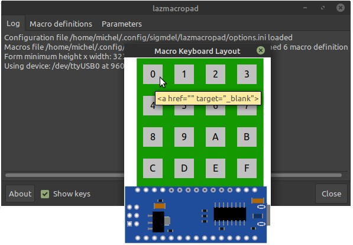

# lazmacropad
**Version 0.2.0**

A rudimentary macro keypad based on the Arduino Nano and a simple Free Pascal/Lazarus program that pastes macros into the currently focused desktop application.

Currently the desktop program runs on Linux only.



**Table of Content**
<!-- TOC -->

- [1. Hardware](#1-hardware)
- [2. Theory of Operation](#2-theory-of-operation)
- [3. Source Code and Prerequisites](#3-source-code-and-prerequisites)
  - [3.1. Linux Requirements](#31-linux-requirements)
- [4. Acknowledgment](#4-acknowledgment)
- [5. License](#5-license)

<!-- /TOC -->
## 1. Hardware

Only three items are needed to implement a basic macro keypad:

  1. A switch matrix. The program assumes that the key pad is composed of 16 switches arranged in a 4 x 4 matrix.

  2. An Arduino Nano R3. This is an older, smaller, Arduino board based on the ATmega328P microcontroller. It has a Mini-B USB socket, but some clones come with a Micro or Type-C USB connector.

  3. An appropriate USB cable to connect the Nano to a desktop or portable computer.

Basically, any development board with 8 digital I/O pins and a serial port could be used, but the Nano and the readily available 4x4 tactile push button matrix shown below are very easily connected to 
each other.


Note that the Nano is upside down (microcontroller is on the hidden side of the board) so that the USB cable will go off to the right.

## 2. Theory of Operation

```
4 rows x 4 columns key pad
+-------------- +                   +------+                +----------------------------------------+
| o   o   o   o |                   | Nano |                |  Desktop                               |
| o   o   o   o | <---------------> |  v3  |                |                                        |
| o   o   o   o |     eight I/O     |      | <-- serial --> | <---> Lazarus service --> Application  | 
| o   o   o   o | <---------------> |      |                |                                        |
+-------------- +                   +------+                +----------------------------------------+
```               

The Nano continuously scans the key pad. When it detects that a key has been pressed, it sends a corresponding single letter string or *message* (i.e. '0', '1' or 'f') to the desktop or portable over the serial (USB) connection. 

The Lazarus/Free Pascal program translates macro key *messages* from the Nano into strings or macros that are sent to whichever application is active on the desktop. Each macro is copied to the system clipboard and then a Ctrl+V is injected into the keyboard event queue of the active application to paste the content of the clipboard.

The program also allows for editing, saving and loading macro definitions to suit any number of applications on the desktop.

## 3. Source Code and Prerequisites

[nanoMacroPad.ino](nanoMacroPad/nanoMacroPad.ino) contains the Arduino sketch that runs on the Nano. It requires the [Keypad library](https://playground.arduino.cc/Code/Keypad/) ([GitHub repository](https://github.com/Chris--A/Keypad)) by Mark Stanley and Alexander Brevig. It can be installed with the Arduino IDE library manager.

The source code of the object pascal program consists of the following files:

    lazmacropad.lpi
    lazmacropad.lpr
    lazmacropad.res
    lazmacropad.ico
    main.pas, main.lfm 
    about.pas, about.lfm 
    layout.pas, layout.lfm
    params.pas

The `MouseAndKeyInput` unit is used to generate the Ctrl-V keyboard event which is the usual paste keyboard shortcut. The unit is found in the `lazmouseandkeyinput` non-visual package. Add it in the `Required Packages` in the `Project Inspector` window (which is opened from the `Project` menu in the IDE).

### 3.1. Linux Requirements

The source was compiled in Lazarus (version 2.3.0 / Free Pascal compiler 3.3.1) on a Linux Mint 20.1 desktop and tested on the same machine. 

The `libxtst` library is required. In recent versions of **Debian** the package containing this library is called `libxtst6`. In Linux Mint 20.1, the package was installed but the library could not be found until a symbolic link was added. 

```bash
$ cd /usr/lib/x86_64-linux-gnu
$ sudo ln -s libXtst.so.6.1.0 libXtst.so
```

Check if that is necessary with the following commands.

```bash
$ sudo updatedb
$ locate libXtst
```

## 4. Acknowledgment

There is no shortage of information on all sorts of more or less sophisticated macro key pads. 
The Brian Lough video, [The Simplest DIMY Macro Keypad with Arduino](https://www.youtube.com/watch?v=ORujXGDqG_I&ab_channel=BrianLough) was the initial inspiration, but that project is based on an Arduino Pro Micro. The Cristian Bastidas (crixodia) [arduino-nano-macro-keypad](https://github.com/crixodia/arduino-nano-macro-keypad) GitHub repository showed how to create a similarly simple project using a Python script on the desktop.


## 5. License

Licence

The **BSD Zero Clause** ([SPDX](https://spdx.dev/): [0BSD](https://spdx.org/licenses/0BSD.html)) licence applies to the original code in this repository.


<!-- -
michel@hp:~$ lsusb
Bus 002 Device 002: ID 8087:8000 Intel Corp. 
Bus 002 Device 001: ID 1d6b:0002 Linux Foundation 2.0 root hub
Bus 001 Device 002: ID 8087:8008 Intel Corp. 
Bus 001 Device 001: ID 1d6b:0002 Linux Foundation 2.0 root hub
Bus 004 Device 001: ID 1d6b:0003 Linux Foundation 3.0 root hub
Bus 003 Device 005: ID 058f:6362 Alcor Micro Corp. Flash Card Reader/Writer
Bus 003 Device 004: ID 0471:060c Philips (or NXP) Consumer Infrared Transceiver (HP)
Bus 003 Device 003: ID 04f3:0103 Elan Microelectronics Corp. ActiveJet K-2024 Multimedia Keyboard
Bus 003 Device 007: ID 0a5c:21f1 Broadcom Corp. HP Portable Bumble Bee
Bus 003 Device 009: ID 1a86:7523 QinHeng Electronics HL-340 USB-Serial adapter
Bus 003 Device 008: ID 05e3:0608 Genesys Logic, Inc. Hub
Bus 003 Device 006: ID 05e3:0608 Genesys Logic, Inc. Hub
Bus 003 Device 002: ID 0461:4e23 Primax Electronics, Ltd HP USB Optical Mouse
Bus 003 Device 001: ID 1d6b:0002 Linux Foundation 2.0 root hub
->
