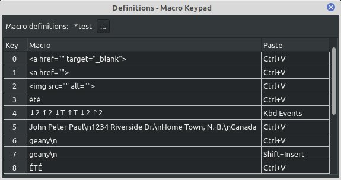

# *lazmacropad* - a Macro Keypad

**Current Release Version: 1.0.0** (October 1, 2023)

A simple macro keypad build around a microcontroller and written in Free Pascal / Lazarus. Its distinguishing feature is that it is keymap agnostic because it uses the operating system clipboard to paste strings into the currently running application. Nevertheless, macros can be injected as keystrokes if desired.

Currently two microcontroller solutions are proposed.

- A very low-cost version based on an Arduino Nano AVR microcontroller and a cheap ubiquitous keypad made of tactile switches

- A *soft* keypad based on TFT display with a resistive touch screen.


**Table of Content**
<!-- TOC -->

- [1. Description](#1-description)
- [2. Status](#2-status)
  - [2.1. Version 1.0.0 (Oct. 1, 2023)](#21-version-100-oct-1-2023)
  - [2.2. The 0.9.4 Release (Aug. 26, 2023)](#22-the-094-release-aug-26-2023)
  - [2.3. The 0.8.6 Release (Nov. 2022)](#23-the-086-release-nov-2022)
  - [2.4. Version 0.3.4 (0ct. 28, 2022)](#24-version-034-0ct-28-2022)
- [3. Hardware](#3-hardware)
  - [3.1. AVR Macro Keypad](#31-avr-macro-keypad)
  - [3.2. CYD Macro Keypad](#32-cyd-macro-keypad)
- [4. Microcontroller firmware](#4-microcontroller-firmware)
- [5. Linux Requirements](#5-linux-requirements)
  - [5.1. `Xtst` Library](#51-xtst-library)
  - [5.2. Changes to the `lazmouseandkeyinput` package](#52-changes-to-the-lazmouseandkeyinput-package)
  - [5.3. Serial USB Device Problem in Mint 21 and Ubuntu 22.04](#53-serial-usb-device-problem-in-mint-21-and-ubuntu-2204)
- [6. Windows Requirements](#6-windows-requirements)
- [7. Macros](#7-macros)
- [8. Clipboards and Paste Commands](#8-clipboards-and-paste-commands)
  - [8.1. Notes](#81-notes)
- [9. Accommodating Different Keypads](#9-accommodating-different-keypads)
- [10. Further Developments](#10-further-developments)
- [11. Documentation](#11-documentation)
- [12. Acknowledgment](#12-acknowledgment)
- [13. Licence](#13-licence)

<!-- /TOC -->

## 1. Description 

This project describes a simple macro keypad serially connected to a computer. The keypad is continuously scanned by a microcontroller which transmits a single letter string or *message* ('0', '1', ...) when a key on the pad is pressed. These *messages* are translated into *macros* by *lazmacropad* a Lazarus/Free Pascal program running in the background. When the macro is a string it is copied to the system clipboard and then an emulated key combination (Ctrl+V, Shift+Insert, or a user-defined custom key combination) is injected into the keyboard event queue of the active application to paste the content of the clipboard. Starting with version 0.8.0 it is possible to bypass the clipboard altogether and to inject a macro consisting of an array of keyboard events.

The Lazarus program also allows for editing, saving and loading macro definitions to suit any number of applications on the desktop.

## 2. Status 

### 2.1. Version 1.0.0 (Oct. 1, 2023)

The current version is a major refactoring of the source code. The source files have been restructured.

  - The root `/` directory contains the project definition files and resources. 
  - The `/units` directory contains non-visual components. 
     - File names have been changed with a `u` suffix. 
     - There is a new `umacros` unit that contains `TMacro` and `TMacroList` classes and a new `uconfig` unit dedicated to the `TConfig` class exclusively. Formally `params` contained the all this code.
     - There is a new `ulog` unit that provides centralized logging to three facilities: the console (stdout), the *lazmacropad* log window and the system log.

  - The `/forms` directory contains the visual components which are not much different from before from the user point of view. 

This reworked version is laying the groundwork for possible extensions where a *soft keypad* is used which would allow for different button layouts depending on the macros file used. 

The current version has been compiled in Linux Mint 21.2 with the Qt5 widget set. That may explain why the icon displayed in the system tray reflects the state of the serial connection much better than previously. 

Binaries will be forthcoming after further use, tests, and inevitable bug fixes.


### 2.2. The 0.9.4 Release (Aug. 26, 2023)

The [0.9.4 release](releases/tag/v0.9.4) contained bug fixes (up to and including issue #4) and some notable improvements:

  - streamlined paste command handling, 
  - support for the right Alt modifier key (labelled Alt Gr on some ISO keyboards) which allow for a fourth shift state,
  - a more robust serial link between the key pad and the computer.
  
To use this version of *lazmacropad* the microcontroller firmware must be running version 2.

Executable binaries were included.

### 2.3. The 0.8.6 Release (Nov. 2022)

The [0.8.6 release](releases/tag/v0.8.6) of *lazmacropad* was much different:
  - *lazmacropad* became a tray icon application
  - Macros could be strings copied to an application via the clipboard or arrays of keyboard events injected in the system event queue.
  - A choice of paste commands for each string macro was provided.
  - Flexibility to handle different sized keypads was added.

This is the first release to contain executables. This is the only release to contain a 32-bits Windows executable.

### 2.4. Version 0.3.4 (0ct. 28, 2022)

[Version 0.3.4](releases/tag/v0.3.4) was the last version where *lazmacropad* ran as a normal program. 


## 3. Hardware

### 3.1. AVR Macro Keypad

Only three items are needed to build a basic macro keypad:

  1. An Arduino Nano R3. This is an older, smaller, Arduino board based on the ATmega328P microcontroller. It has a Mini-B USB socket, but some clones come with a Micro or Type-C USB connector.

  2. A switch matrix. The program assumes that the key pad is composed of 16 switches arranged in a 4 x 4 matrix. The Arduino sketch on the Nano and *lazmacropad* can handle keypads with up to 36 keys (and more with changes to the code). Of course, a 36 key array requires a minimum of 12 I/O pins. Not all microcontrollers have so many I/O pins, but the Nano does have 18 digital I/O pins plus the Rx and Tx pins for the serial connection.

  3. An appropriate USB cable to connect the Nano to a desktop or portable computer.

The Nano and the readily available 4x4 tactile push button matrix shown below are very easily connected to each other.


Note that the Nano is upside down (microcontroller is on the hidden side of the board) so that the USB cable will go off to the right. The Nano could be connected facing in the other direction by flipping it right side up if it is more convenient to orient the cable towards the left. The character transmitted over the serial port as each key is pressed and the mapping of the Nano I/O pins in the Arduino sketch should be modified according to the number rows and columns of keys on the keypad and its desired orientation. 

### 3.2. CYD Macro Keypad

An ESP32-2432S028R (aka CYD - [Cheap Yellow Display](https://github.com/witnessmenow/)) development board which contains an ESP32 microcontroller with 4MB flash memory, a 
2.8 inch (320x240 pixels) TFT display and a resistive touch screen. Beside the firmware, the only other required hardware component is an appropriate USB cable to connect the display to a desktop or portable computer.


## 4. Microcontroller firmware

The microcontroller **must run version 2** of the firmware supplied with versions 0.9.0 and newer of *lazmacropad*. The source code is in the [nanoMacroPad](nanoMacroPad/) directory.

The source code for the ESP32+TFT display soft macro key pad is in the [cydMacroPad](cydMacroPad/) directory.

## 5. Linux Requirements

### 5.1. `Xtst` Library

The `Xtst` library is required by the `lazmouseandkeyinput.lpk` package. In recent versions of Debian, the package containing this library is called `libxtst6` and it is probably included in most Debian-based desktop distributions. This is the case for Linux Mint 20.1 Mate and Mint 21 Mate. If the library is missing, it can be installed in the usual fashion.

```bash
$ apt install libxtst6
```

Although the library was installed in Mint 20.1, it could not be found because of a missing symbolic link to `libXtst.so`. 

```bash
$ locate libXtst
/usr/lib/x86_64-linux-gnu/libXtst.so.6
/usr/lib/x86_64-linux-gnu/libXtst.so.6.1.10
```

In that case, add the symbolic link and update the library database.

```bash
$ cd /usr/lib/x86_64-linux-gnu
$ sudo ln -s libXtst.so.6.1.0 libXtst.so
$ sudo updatedb
```

The directory in which are stored system libraries are stored is not necessarily called `/usr/lib/x85_64-linux-gnu` so adust the above in accordance with the output obtained from the `locate` command.

It appears some have been installing the development package `libxtst-dev` in a bid to add the missing symbolic link, but there is no need for that. 


### 5.2. Changes to the `lazmouseandkeyinput` package

See the [mouseandkeyinput](mouseandkeyinput/) directory for needed additions and corrections to the `lazmouseandkeyinput` package.

**Warning**: *lazmacropad* may not run at all if the changes are not made.

### 5.3. Serial USB Device Problem in Mint 21 and Ubuntu 22.04

The serial device, usually `/dev/ttyUSB0` on my systems, would not be created on connection of the Nano to the desktop in Mint 21 and Ubuntu 22.04. That was unusual because the USB device was found.

```bash
michel@hp:~$ lsusb
...
Bus 003 Device 006: ID 1a86:7523 QinHeng Electronics HL-340 USB-Serial adapter
... 
```

That means that the Arduino IDE could not be used to flash the sketch on the Nano nor could a flashed macro keypad work with those systems. The following log entry provided a hint as to the cause of the problem.
  
```
usbfs: interface 0 claimed by ch34x while 'brltty' sets config #1 #18 
```

A quick search yielded a couple of *StackExchange* queries ([Unable to use [...] on USB-serial converter chip](https://unix.stackexchange.com/questions/670636/unable-to-use-usb-dongle-based-on-usb-serial-converter-chip) and [On Linux Min21, unable to access tools/port...)](https://arduino.stackexchange.com/questions/90954/on-linux-min21-unable-to-access-tools-port-grayed-out) and a blog post ([Solved: brltty – USB COM Port Gets Immediately Disconnected](https://lynxbee.com/solved-brltty-usb-com-port-gets-immediately-disconnected/#.Y20o5ZCZNhE)). It seems that the screen reader [BRLTTY](https://brltty.app/) is now enabled by default and it takes over the serial port which I assume would be connected to a Braille display.

There are two ways to "resolve" the situation: disable the service as explained in the first two references or remove the `brltty` package altogether with the usual `apt remove brltty` command as explained in the last reference. Unfortunately, this is not a working solution for those that need the screen reader.  

## 6. Windows Requirements

Only one file in the `lazmouseandkeyinput` package has to be changed in Windows. See the [mouseandkeyinput](mouseandkeyinput/) directory for details.

Otherwise there are no other requirements in Windows.

## 7. Macros

There are two types of macros:

  - Strings that are copied to the clipboard and, from there, pasted into an application with a user-selectable keyboard paste command.
  - Arrays of keyboard events directly injected into the operating system keyboard handler.




Macros 3 in the macro definition window shown above, injects `été` into the currently focused application on the computer running *lazmacropad*. Macro 4 is a keyboard events macro that will inject `été` on computers that use the French (AZERTY) key map, while `2t2` will be injected where a QWERTY type keyboard is used. Macro 3 pastes `été` no matter which key map is used.

The strings are UTF8 encoded and can contain 3 escape sequences

  -  `\n` will be converted to #13 (RETURN)
  -  `\t` will be converted to #9  (TAB)
  -  `\\` will be converted to `\`

If a string macro is edited with the dedicated multiline editor (reached with the context menu), the latter will take care of encoding the RETURN, TAB and backslash. This editor can be launched from the context menu available when a string macro is selected.

Appending a `\n` sequence to a macro used in a terminal should mean that the string macro is a command to be executed as soon as the corresponding macro key is pressed. In Linux at least, this does not work. Consequently, a trailing newline escape sequence is stripped from the string pasted into the clipboard and replaced with a `VK_RETURN` key press after the string is pasted. This does work and should not change anything if such the macro is used with another application. However an empty new line is inserted but the clipboard content is not be copied beforehand in VSCodium. This unexpected behaviour does not occur in Geany and it may be related to the QT5 widget set because it did not occur with the GTK2 widget set. As a work around, a relatively long delay before injecting `VK_RETURN` provides enough time for the completion of the clipboard operation. The delay can be set with the `Paste command delay...` option in the `Macro Definitions` window; press the `[...]` button to see the option.


**Notes**

  1. Each key down event (↓) must be followed by a corresponding key up event (↑) otherwise the operating system will generate a sequence of autorepeat key down events. The same applies to the Shift, Ctrl and Alt modifier keys. Macros 2 and 3 are similar to the first two except that they insert the uppercase string `HELLO` followed by a carriage return. Note how the Shift modifier was activated with the `H` key and deactivated with the `O` key, just as most would keep the shift key depressed when entering a few uppercase characters at a keyboard.

  1. As already stated, the virtual keyboard events injected into the keyboard event queue will be translated according to the keyboard layout in current use. So if the layout is the ISO French AZERTY keyboard, then the sequence `(↓ 2)(↑ 2)(↓ 7)(↑ 7)` will insert `éè` in the focused application. How this is done with a sequence of keyboard events with an ANSI US (QWERTY) keyboard is not at all clear.

## 8. Clipboards and Paste Commands

Each macro must be assigned a paste command from the following list:

  1. `Ctrl+V`              
  2. `Shift+Insert`
  3. `Custom`    (`Shift+Ctrl+V` by default)
  4. `None`
  5. `Kbd Events`

The last choice `Kbd Events` is not a paste command, it identifies a macro as being an array of keyboard events to be directly injected into the operating system keyboard handler. 

Similarly `None` is not a paste command. If selected, the string macro will be copied into the system clipboard and nothing else will be done. The user can paste the content of the clipboard by using a keyboard shortcut or any other appropriate method.

The other three choices are true paste commands or better yet keyboard short cuts that are forwarded to the focused application via the keyboard handler in the hope that the content of the clipboard will be pasted as a consequence. 

Testing so far seems to indicate that `Ctrl-V` works well in Windows and surprisingly `Shift-Insert` does not. 

In Linux, the situation is more complex. `Ctrl-V` will work most times as will `Shift-Insert`. However, neither of these will work at the command line prompt of a terminal. In that case the custom paste command which is `Shift+Ctrl+V` by default may work (it does in the MATE terminal). Because it might be worthwhile to experiment with other shortcuts, such as `Mouse_Middle` which pastes selections in X11, it is possible to redefine the custom paste command. There is a restriction as there can be only one custom definition per macro definitions file.

### 8.1. Notes 

- When running in Linux, *lazmacropad* copies a string macro into the clipboard, also copies it into the primary selection. This is the behaviour of many applications (Geany, VSCodium, VS Code, GNote, LibreOffice Writer and the Lazarus IDE editor,... ), which synchronize the two mechanisms so that pasting selected text can be done with `Ctrl+V` or `Shift+Insert`. 

- When running in Windows, `Shift+Insert` does not work as a paste command even if it can be used on the physical keyboard. 

## 9. Accommodating Different Keypads

With version 0.7.2, *lazmacropad* can handle keypads with up to 36 keys. Starting with version 0.8.6 it is no longer necessary to edit the configuration file manually to set the number of rows and columns. This can be done in the `Parameters` window.  Adjustments in those values will be reflected as soon as they are set.

The default values are 4 columns and 4 rows. There is a 36-key limit which is arbitrary. Should one wanted to have an even bigger keypad then additional character *messages* to the `SKeyLabels` resource string  in `uconfig.pas` and the `hexaKeys` array of chars in the Arduino sketch has to be adjusted as a consequence. Other values must also be adjusted in the Arduino sketch: `ROWS`, `COLS` and the byte arrays `rowPins` and `colPins`.

## 10. Further Developments

The project is complete in its present form meaning that new functionality is envisioned only as a consequence of a hardware enhancement such as the addition of a rotary encoder. That would be getting away from the initial goal of creating a very simple hardware project.

An upcoming version 1.0 will therefore be limited to code improvements only. In particular, the current implementation of macro definitions needs to be refactored and the same is true of the serial connection code. There is no target date for that version.

## 11. Documentation 

There is a [post about this project](https://sigmdel.ca/michel/program/fpl/macrokeypad/basic_macrokeypad_fr.html) which contains a draft *user manual*. It is an incomplete, does not cover changes made after release 0.8.6 and currently available in French only.

## 12. Acknowledgment

There is no shortage of information on all sorts of more or less sophisticated macro key pads. The Brian Lough video, [The Simplest DIY Macro Keypad with Arduino](https://www.youtube.com/watch?v=ORujXGDqG_I&ab_channel=BrianLough) and corresponding [GitHub repository, arduino-switcheroonie,](https://github.com/witnessmenow/arduino-switcheroonie) stands out for its simplicity, but that project is based on an Arduino Pro Micro. The Cristian Bastidas (crixodia) [arduino-nano-macro-keypad](https://github.com/crixodia/arduino-nano-macro-keypad) GitHub repository showed how to achieve something very similar  with a Nano and a Python script on the desktop. This later project is clearly the model for *lazmacropad*.

## 13. Licence

Copyright 2022, 2023 Michel Deslierres, no rights reserved.

In those jurisdictions where releasing a work into the public domain may be a problem, the **BSD Zero Clause Licence** ([SPDX](https://spdx.dev/): [0BSD](https://spdx.org/licenses/0BSD.html)) applies.
